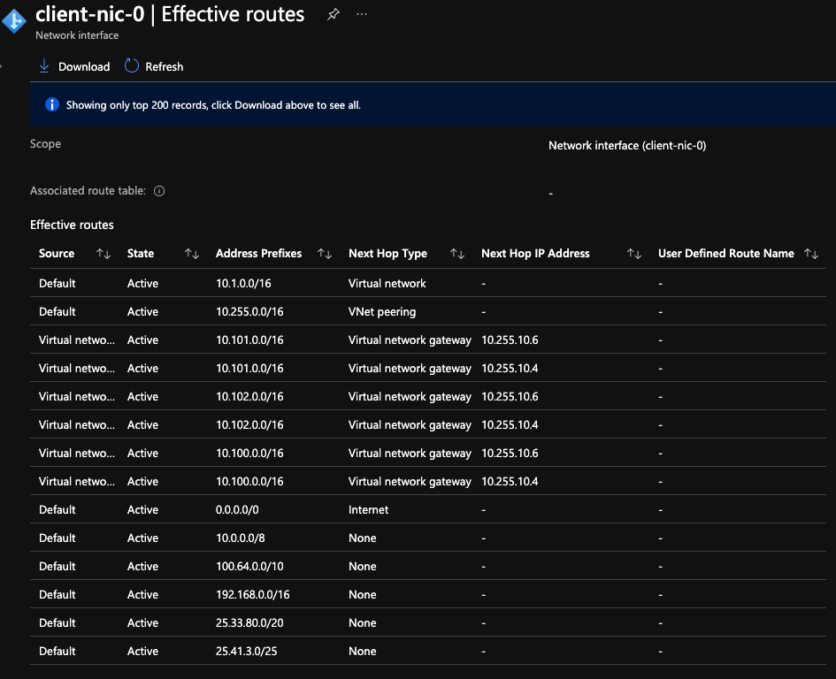

# Description
Azure Route Server and BIG-IP using BGP and eCMP for traffic distribution

## TO DO - WORK IN PROGRESS
1. Wait for Azure Route Server GA...currently in preview
2. Finish BIG-IP setup with test app
3. Remove test network virtuals (10.100, 10.101, 10.102)...testing only
4. More README, more how-to steps

## Diagram


## Requirements

- Azure CLI
- Terraform
- Azure Subscription
- Azure User with 'Owner' role

## Login to Azure Environment

```bash
# Login
az login

# Show subscriptions
az account show

# Set default
az account set -s <subscriptionId>
```

## Usage example

- Clone the repo and open the solution's directory
```bash
git clone https://github.com/JeffGiroux/f5_terraform.git
cd f5_terraform/Azure/Route_Server/
```

- Create the tfvars file and update it with your settings

```bash
cp admin.auto.tfvars.example admin.auto.tfvars
# MODIFY TO YOUR SETTINGS
vi admin.auto.tfvars
```

- Run the setup script to deploy all of the components into your Azure account (remember that you are responsible for the cost of those components)

```bash
./setup.sh
```

## Test your setup

- View the created objects in Azure Portal. Choose a VM instance or NIC from a spoke VNet and view "Effective Routes". You will see BIG-IP advertised routes via BGP across the VNet peering.



- View BPG peering on the Azure Route Server object in the portal - https://aka.ms/routeserver


- Validate BGP peering on BIG-IP using tmsh
```bash
(tmos)# show net routing bgp
------------------------------------------
Net::BGP Instance (route-domain: 0)
------------------------------------------
  Name                               myBGP
  Local AS                           65530

  ----------------------------------------------------------------------------
  | Net::BGP Neighbor - 10.255.255.5 via 10.255.10.4
  ----------------------------------------------------------------------------
  | Remote AS                   0           
  | State                       established   0:06:24
  | Notification                Cease/Administratively Shutdown.
  | Address Family              IPv4 Unicast  IPv6 Unicast
  |  Prefix                   
  |   Accepted                  3              
  |   Announced                 6              
  |  Table Version            
  |   Local                     6              
  |   Neighbor                  6              
  | Message/Notification/Queue  Sent          Received
  |  Message                    27            26
  |  Notification               0             2
  |  Queued                     0             0
  | Route Refresh               0             0
```

- View running config on BIG-IP using imish
```bash
(tmos)# imish
f5vm01.example.com[0]#show running-config 
!
service password-encryption
!
bgp extended-asn-cap 
!
router bgp 65530
 bgp graceful-restart restart-time 120
 aggregate-address 10.100.0.0/16 summary-only
 aggregate-address 10.101.0.0/16 summary-only
 aggregate-address 10.102.0.0/16 summary-only
 redistribute kernel
 neighbor Neighbor peer-group
 neighbor Neighbor remote-as 65515
 neighbor Neighbor ebgp-multihop 2
 no neighbor Neighbor capability route-refresh
 neighbor Neighbor soft-reconfiguration inbound
 neighbor Neighbor prefix-list /Common/myPrefixList1 out
 neighbor 10.255.255.4 peer-group Neighbor
 neighbor 10.255.255.5 peer-group Neighbor
 !
 address-family ipv6
 neighbor Neighbor activate
 no neighbor 10.255.255.4 activate
 no neighbor 10.255.255.4 capability graceful-restart
 no neighbor 10.255.255.5 activate
 no neighbor 10.255.255.5 capability graceful-restart
 exit-address-family
!
ip route 0.0.0.0/0 10.255.10.1
!
ip prefix-list /Common/myPrefixList1 seq 10 permit 10.0.0.0/8 ge 16
!
line con 0
 login
line vty 0 39
 login
!
end
```

- Validate BGP on BIG-IP using imish
```bash
f5vm01.example.com[0]>show ip bgp summary
BGP router identifier 10.255.20.4, local AS number 65530
BGP table version is 6
2 BGP AS-PATH entries
0 BGP community entries

Neighbor        V    AS MsgRcvd MsgSent   TblVer  InQ OutQ Up/Down  State/PfxRcd
10.255.255.4    4 65515      20      17        6    0    0 00:02:38        3
10.255.255.5    4 65515      19      20        6    0    0 00:02:38        3

Total number of neighbors 2

##
f5vm01.example.com[0]>show ip bgp
BGP table version is 6, local router ID is 10.255.20.4
Status codes: s suppressed, d damped, h history, * valid, > best, i - internal, l - labeled
              S Stale
Origin codes: i - IGP, e - EGP, ? - incomplete

   Network          Next Hop            Metric     LocPrf     Weight Path
*  10.1.0.0/16      10.255.255.5             0                     0 65515 i
*>                  10.255.255.4             0                     0 65515 i
*  10.2.0.0/16      10.255.255.5             0                     0 65515 i
*>                  10.255.255.4             0                     0 65515 i
*> 10.100.0.0/16    0.0.0.0                                    32768 ?
*> 10.101.0.0/16    0.0.0.0                                    32768 ?
*> 10.102.0.0/16    0.0.0.0                                    32768 ?
*  10.255.0.0/16    10.255.255.5             0                     0 65515 i
*>                  10.255.255.4             0                     0 65515 i

Total number of prefixes 6
```

## Troubleshooting
If you don't see routes in the spoke VNets, then try deleting the VNet peering and re-run Terraform to have it create the peer again. If you happen to run into this issue, open an issue directly with Azure support to provide feedback.

## Cleanup
Use the following command to destroy all of the resources

```bash
./destroy.sh
```

## How to Contribute

Submit a pull request

# Authors
Jeff Giroux
